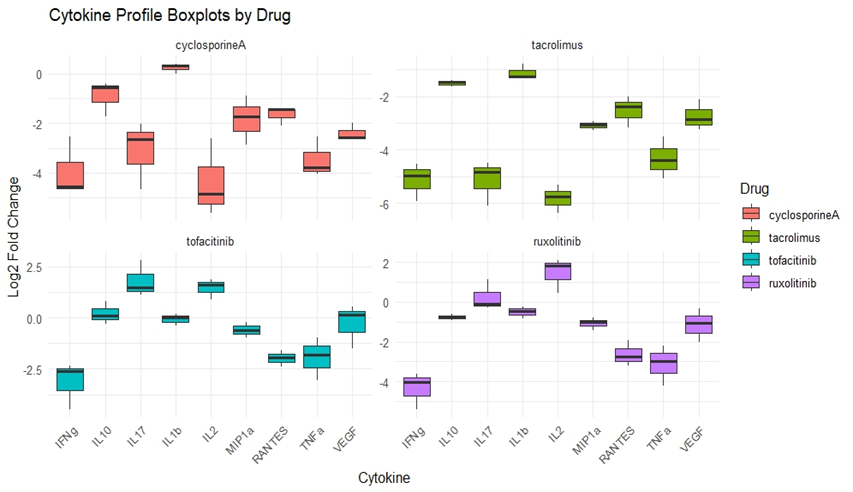
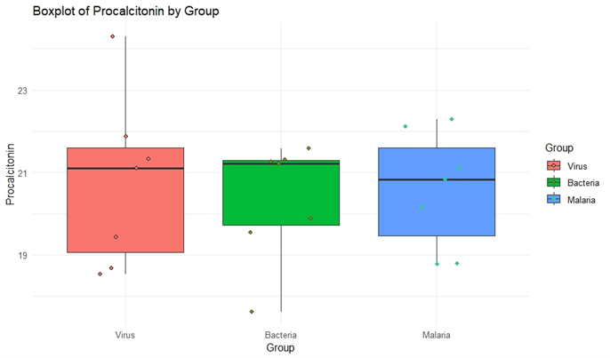
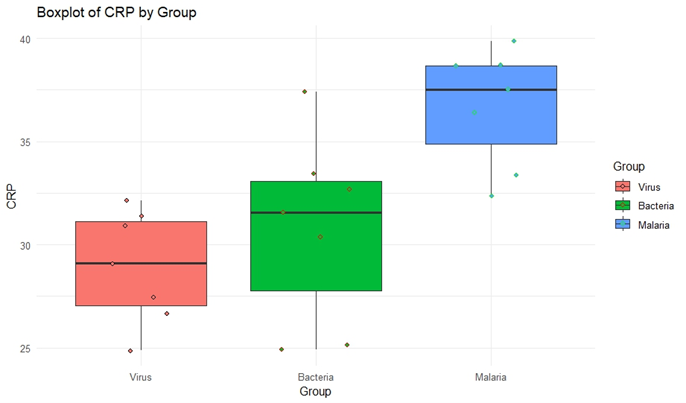

# Cytokine-Drug-Response-Analysis
🔍 Emphasizing Discovery and Clustering 

Multivariate profiling of drug-induced cytokine shifts and biomarker-based infection classification using PCA, correlation analysis, and MANOVA in R.

# 🧬 Cytokine Drug Response & Biomarker Profiling in R

This project combines two biological analysis tracks:

1. **Experimental proteomics**: profiling immunosuppressive drug effects on cytokine secretion across 9 compounds  
2. **Clinical diagnostics**: evaluating Procalcitonin and CRP levels to differentiate infection types (Virus, Bacteria, Malaria)

---

## 🧠 Analysis Tracks

### 1️⃣ Immunosuppressive Drug Profiling
- Log2 fold change of cytokine expression
- Correlation matrix with Bonferroni-corrected significance
- PCA and varimax-rotated factor analysis
- Drug loading interpretation and component clustering

### 2️⃣ Infection Type Classification
- Jittered boxplots for CRP and Procalcitonin
- MANOVA and post-hoc ANOVA with TukeyHSD
- Full assumption testing (normality, multicollinearity, Box’s M)

---

## 📈 PCA Loadings Summary (Top 2 Components)

| Drug          | PC1     | PC2     |
|---------------|---------|---------|
| astaxanthin   | -0.3226 | -0.2082 |
| cyclosporineA | -0.2317 |  0.4466 |
| dexamethasone | -0.3339 |  0.2732 |
| everolimus    | -0.4158 | -0.0275 |
| levalbuterol  | -0.3713 |  0.0490 |
| ruxolitinib   | -0.3125 | -0.4526 |
| sirolimus     | -0.3845 | -0.0052 |
| tacrolimus    | -0.2951 |  0.5027 |
| tofacitinib   | -0.2957 | -0.4710 |

📄 Full file: [`pca_loadings.csv`](results/pca_loadings.csv)

---

## 🔬 MANOVA Summary

```
MANOVA (Hotelling-Lawley test): p-value = 0.004
CRP showed significant differences between Malaria vs Virus (p=0.001) and Malaria vs Bacteria (p=0.01)
Procalcitonin did not show significant differences across groups (p > 0.05)
```

📄 Full file: [`manova_summary.txt`](results/manova_summary.txt)

---

## 📊 Boxplot Visualizations

### 🔹 Immunosuppressive Drug Effects



- Visualizes log2 fold-change across 9 cytokines for selected drugs:
  - Cyclosporine A
  - Tacrolimus
  - Tofacitinib
  - Ruxolitinib

### 🔹 Clinical Biomarkers by Infection Type

**Procalcitonin:**



**CRP:**



Each figure includes jittered data points colored by group (Virus, Bacteria, Malaria).

---

## 📂 Folder Structure

```
Cytokine-Drug-Response-Analysis/
├── src/
│   └── Cytokine_CRP_Analysis.Rmd
├── data/
│   └── drugs_2019.csv
├── results/
│   ├── pca_loadings.csv
│   ├── manova_summary.txt
│   └── boxplots/
│       ├── Cytokine_log2FC_boxplot.png
│       ├── Procalcitonin_boxplot.png
│       └── CRP_boxplot.png
├── README.md
```

---

## 🚀 How to Reproduce

1. Open the `.Rmd` file in RStudio  
2. Install required packages:
```r
install.packages(c("psych", "ggplot2", "mvnormtest", "biotools"))
```
3. Run each section step-by-step, starting from data import

---

## 👨‍💻 Author

**Fares Ibrahim**  
Bioinformatician | Immunology | Biomarker Discovery  
🔗 [GitHub](https://github.com/Fares77-a11y)

---

## 📄 License

MIT License — see `LICENSE` file for terms.
